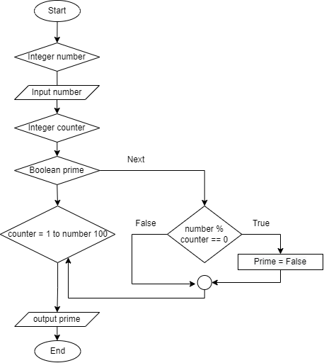

# T1A1 - Workbook
---
## Q1

Markup language is a human readable computer language written in plain text. All markup languages share a common feature which are tags to help specify different contents and create structures on the webpage. Common markup languages include HTML, and XML (Per Christensson 2022).

Markup languages are understood by web browsers due to the standards based on the consistency in processing documents by markup languages (IPL n.d).

BYJU’S (n.d) states as the following:

- **HTML (HyperText Markup language):** 
  
  Displays data and describes the structure of a webpage.

- **XML (Extensible Markup Language):** 
  
  Stores and transfers data.

## Q2

### Packets

Data are split into pieces or information which are then called packets. The are sent through various routes which are then reassembled back together into a message. The packet contains information including sender’s IP address, destination of the packet, email reassembling information, a check sum for error detection and many more. (theteacher.info 2022) Packets are faster and easier to send over the network evenly distributed, preventing from getting stuck in one route whereas to move a large piece of information is a lot more difficult. (Live Action 2021)

### IP addresses (IPv4 and IPv6)

Internet Protocol addresses (IP) are identified through devices or a local network to communicate with each other. (Kaspersky n.d)
ThousandEye (n.d) covers the difference between IPv4 and IPv6:

- **IPv4 (Internet Protocol version 4):** 
  
  The original version of Internet Protocol. IPv4 is a 32-bit address, carrying 2^32 addresses which is approximately 4 billion addresses. It is the primary IP version that is widely used carrying ‘94% of the Internet traffic’. (Lawrence Williams 2022)

- **IPv6 (Internet Protocol version 6):** 
  
  The newest version of Internet Protocol. IPv6 uses a 128-bit address, many times larger than IPv4. IPv6 addresses the shortages of Internet address due to IPv4.

### Routers and routing

Routers is a network device that forwards packets to their destination by connecting to another IP network or subnetworks and passing data packets. When the router receives a packet, the packet header is read to see the intended destination (cloudflare n.d). The routing table which the routing information is checked to find the best routing entry ( Marcin Bialy 2018). 

Abhishek Gupta (2018) mentions that Routing table can be static and dynamic.

- **Static Routing:** 
  
  It can only be set up and updated by the network administrator and is suitable to small networks

- **Dynamic Routing:** 
  
  It updates automatically and is suitable for large networks. Dynamic routers determine the shortest and fastest path through various protocols. 

### Domains and DNS

- **Domains:**
  
  The terms domain and domain name are interchangeable, referring to the location of a website. The length of a domain name can be up to 63 characters (Computer Hope 2017). The first word in a domain name, like 'google,' and the last word, such as '.com,' are referred to as top and second level domains. (Marshal Brain, Nathan Chandler & Stephanie Crawford 2021).

- **DNS:**
  
  The Domain Name System (DNS) connects devices and servers to the internet. To locate and load the webpage, it converts domain names into IP addresses (DNS Made Easy n.d). 'The DNS concept is like a phone book for the internet' according to Marshal Brain, Nathan Chandler, and Stephanie Crawford's (2021).

## Q3

### TCP

Fortinet (n.d) states that ‘TCP is a communication standard to exchange messages over the network’. It is to ensure that the data and message is delivered successfully over the network (Fortinet n.d). Once the TCP client and server is established which the server can either accept or reject, the connection stays open until the connection is terminated by either client or server (TAL tech n.d). TCP splits the messages in packets from the server, numbers, and sends them to their destination (sdx central 2022).

### HTTP and HTTPS

- **HTTP (Hypertext Transfer Protocol):** 
  
  HTTP is a client-server protocol used for viewing web pages on the internet (MDN 2021). HTTP uses port 80. Web clients are like web browsers such as google, safari, and Mozilla. The browsers are accessed by sending a request to the web server through HTTP protocol. Client sends a request and server responds by methods (Shreya Ghate 2020). In standard HTTP, information is sent in clear text, meaning all information exchanged through the client and server is transferred over the public internet, making it vulnerable to hacking.

- **HTTPS (Secure Hypertext Transfer Protocol):** 
  
  HTTPS has a security feature using TLS (Transport Layer Security), an improved version of SSL (Secure Sockets Layer) on HTTP. The data transferred are encrypted to ensure the data transferred between the client and server is secure and is no longer sent in clear text (_SSL, TLS, HTTP, HTTPS Explained_ 2018). A padlock would be included in the URL to indicate that website is secure on most browsers for HTTPS otherwise without the security feature they will be flagged as not secure (Cloudflare n.d). HTTPS uses port 443. 

### Web browsers (requests, rendering and developer tools)

- **Request:** 
  
  A web request is a communication message sent from the client, or web browser, to the server to access resources which the server will then send a response (Source Defense n.d). 

- **Rendering:**

  Rendering is a web development process that converts website code into the interactive pages that users see when they visit a site. The word refers to the use of HTML, CSS, and JavaScript codes mainly. A rendering engine, the software that allows a web browser to render a web page, completes the process (Seobility n.d).

- **Developer tools:**

  Developer tools has software, platforms, and add-ons are common across browsers. They can help developers in producing high-quality code more quickly. The tools that help get rid of friction, distractions, and context switches (Elinor Swery 2021).

## Q4

### Arrays

Array video was through explained in _Array_ (2020)

An array is used store a list of values. Square brackets `[ ]` enclose an array, and the values are separated by commas. In Ruby, arrays can include any data type, such as integers, strings, and other arrays. An array's index starts at 0. If a value does not exist at a specific location in the array, array returns nil. The negative index begins with -1 for the array's last element.

```
days =  ["Monday", "Tuesday", "Wednesday", "Thursday", "Friday", "Saturday", "Sunday"]
```

### Hashes

_Hashes_ (2020) provides an introduction about hashes

In a hash, a fat arrow => separates a set of key-value pairs. The hashes are enclosed by curly brackets `{ }`. The key can be a string, but symbols are preferable because they point to the same memory location. Values can be any data type separated by commas, including strings, symbols, arrays, and hashes. Values are accessed using the key.

Syntax `{key => value}`

```
profile = {:name => “bob”, :age => 10, :title => :painter, :hobbies = [“painting”, music”], :schedule => {:monday => “painting class”, :tuesday => ”music class”}
```

## Q5

*Compiler and Interpreter: Compiled Language vs Interpreted Programming Languages* (2018) explains that the source codes, a high level language that can be understood by humans are converted into machine language which uses binary by either interpreter and/or compilers. 

### Interpreter 
  
  The source code is copied, and the machine interprets ‘one statement at a time into machine code’ (BI India Bureau 2019). Therefore, the execution time is slower compared to compilers. It will continue to translate until there is an error message making debugging easier. Examples of Interpreted languages are Ruby and Python.

### Compilers
  
  The program is scanned and translated at once, creating a separate file containing the machine code. Error message appears only after it scans the complete program causing debugging to be harder. Compiled programming languages are C and C++, etc. (BI India Bureau 2019).
  
## Q6

### JavaScript

- **Advantages:**
  
  JavaScript is a client-side script that runs quickly.  It is easy to learn and understand due to its simple structure.  It is a popular program among developers and is supported by all modern browsers. JavaScript can be embedded into any webpage or another programming language. Drag and drop functionality, and components like sliders, help to improve the site's user-interactivity.

- **Disadvantages:**
  
  People may exploit JavaScript code for malicious purposes, such as using the source code without authentication or disabling JavaScript entirely, due to a lack of client-side security. JavaScript is occasionally interpreted differently by different browsers. As a result, before publishing, the code should be checked in all main browsers (freeCodeCamp 2019).

### Ruby

- **Advantages:**

  Ruby on rails is an open-source framework that is simple to learn due to its intuitive and user-friendly syntax features. It is also considered a secure technology due to its built-in securities and functionalities (Jakub Jakubowicz 2020). Because of the DRY rule, developers write less code while using RoR, which speeds up application development process. RoR has many open-source libraries which are called gems that enhance or extend the existing functionalities. RoR is supported by an active community of web developers.

- **Disadvantage:**

  There are less creativity, less flexibility due to many default, and set objects. Incorrect decisions made early in the development process can significantly slow down your entire application, cause connectivity issues between different parts of the software, and result in unintended effects (Victor Rak 2021). When compared to competing frameworks like Django and Node.js, RoR has a sluggish runtime speed and performance (Full Scale 2020).

## Q7

###  Access to a user’s personal information (medical, family, financial, personal attributes such as sexuality, religion, or beliefs)

The Privacy Act, which includes the Australian Privacy Principles (APPs), forms the foundation of Australian privacy law. It regulates the collection, use and disclosure of personal information in Australia.

The Australian Privacy Principles (APPs), which are part of the Privacy Act, are the foundation of Australian privacy law. It regulates how personal information is collected, used, and disclosed in Australia.

Small businesses are not required to comply with the APPs because they are not APP entities. 

Because the definition of personal information under Australian privacy law is broad, the law is ineffective in protecting users' personal information privacy, putting them at risk of having their information misused.

Regulations apply to any Australian Computer Society member who works in the field of information and communications technology (ICT). The code includes ‘The Primacy of the Public Interest, The Enhancement of Quality of Life, Honesty, Competence, Professional Development, and Professionalism’. This code helps developers to not breech the public trust, but this only applies to members of the Australian Computer Society.

I believe the regulation is lacking, overly broad, and ineffective in assisting developers in protecting the use of users' personal information.

### Case Study

The Guardian (2014) published an article titled "Facebook reveals news feed experiment to control emotions" on 689,000 users home page, Facebook experimented that if manipulating the news feed through a process called "emotional contagion" could make people feel happier or sadder.

In a study with academics from Cornell and the University of California, Facebook filtered users' news feeds; the flow of comments, videos, pictures, and site links posted by other users in their social network. In one experiment, users were exposed to less "positive emotional material" from their friends, which resulted in fewer positive posts. Another experiment lowered "negative emotional content" exposure, but the opposite occurred.

‘The study concluded: "Emotions expressed by friends, via online social networks, influence our own moods, constituting, to our knowledge, the first experimental evidence for massive-scale emotional contagion via social networks."

According to the study, manipulating the news feed was "consistent with Facebook's data use policy, to which all users agree prior to creating an account on Facebook, constituting informed consent for this research".

The study is against the breach of trust based on the US federal policy for the protection of human subjects by failing to gain 'informed consent,' which needs an explanation of the research purpose and expected duration, as well as a description of any reasonably foreseeable risks and a statement that participation is voluntary.

It is important that before conducting an experiment for research it necessary to inform and gain consent before beginning the experiment. To prevent this from happening it needed to implement stricter rules on how to conduct experiment and consulting with people of expertise such as lawyers to understand what the regulations are and how to do the research in an ethical manner and realising the risk of the research on the company but also, on the participant.

American Psychological Association (2003) has general principles that experiments must abide by for ‘Ethical Principles of Psychologists and Code of Conduct ‘Principle A: Beneficence and Nonmaleficence’ that is to ‘strive to benefit those with whom they work and take care to do no harm.’. ‘Principle B: Fidelity and Responsibility’ implies to ‘establish relationships of trust with those with whom they work.’. ‘Principle C: Integrity’ means ‘to promote accuracy, honesty, and truthfulness in the science, teaching, and practice of psychology.’. ‘Principle D: Justice’ which is to ‘recognize that fairness and justice entitle all persons to access to and benefit from the contributions of psychology and to equal quality in the processes, procedures, and services being conducted’. ‘Principle E: Respect for People's Rights and Dignity’ means ‘respect the dignity and worth of all people, and the rights of individuals to privacy, confidentiality, and self-determination.’

NHMRC (2018) states that ‘First, research participants may enter into a relationship with researchers whom they may not know but need to trust. This trust adds to the ethical responsibility borne by those in whom it is placed. Secondly, many who contribute as participants in human research do so altruistically, for the common good, without thought of recompense for their time and effort. This underscores the importance of protecting research patients.’

To prevent the Facebook experiment incident happening the experiment must be legal, not infringe on human rights, contribute to the greater good, and be ethical.

### Intellectual property, copyright, and acknowledgement
  
Along the rapid advancement of technology, there are ethical concerns about copyright regulations, such as misuse of intellectual property, plagiarism, etc.

When software code is created, it is protected by copyright as an original literary work. To qualify as a literary work and receive copyright protection, software code does not need to be of literary quality.

An example of an ethical issue is that the code does not need to be 'original', meaning that no similar code has been written before by somebody else. The author/developer must demonstrate they created the software using their own skill and labour. If a person writes different, independently produced code, copying the basic idea or functionality of software is not infringing. To protect software functionality in Australia, the copyright holder would need to file a patent application with IP Australia (IP Australia n.d).

A software developer consultant that’s contracted to create software code for a business is the owner of that specific code they created under section 32 of the Copyright Act 1968 (Cth). Some consultancy agreements may include a clause stating that when the software code is created, all the software code is assigned to or will vest in the business owner, not the software developer consultant. This gives the business owner complete ownership of the software (Rigby Cooke 2016).
 
## Q8

### Control Flow

Control flow, also known as control structures, indicates the computer to complete a specific action based on whether or not a condition is met (_Control flow_ 2020). Reserved keywords such as if, else, elsif, and end are used for logical structures (conditionals) (Sonia Dumitru 2019).

### Decision-making Statements

Decision-making statemenets are explored in _Control Flow_ (2020)

- **if Statement**

  The control flow begins with the if keyword, then checks to see if the condition is true, and ends the control flow with the keyword end. The `if`, `elsif`, and `else` keyword is either executed based on whether it is true or false. 

  ```
  raining = true

  if raining
    puts "Carry umbrella"
  else
    puts "Don't carry umbrella"
  end
  ```

- **Ternary operator**
  
  The ternary operator is a shorter version for if else statements, and it works best with only one line of code in if and else block. `?` and `:` are used instead of if and else statements.

  ```
  raining = true

  puts raining ? "Carry umbrella" : "Don't carry umbrella"
  ```

- **Case Statement**
  
  An alternate syntax to the `if else` statement is the `case when` statement. The control flow begins with the keyword case, which then determines whether or not a condition matches with the when statement. If no other statement matches, the control flow is ended with end keyword. Case statements should not be used for simple logic such as true or false.

  ```
  capacity = 21
  
  case capacity
  when 0
    "You ran out of gas"
  when 1..20
    "The tank is almost empty"
  when 21..70
    "You should be ok for now"
  when 71..100
    "The tank is almost full"
  else
    "Error: capacity has an invalid value (#{capacity})"
  end
  ```
### Loop statements

- **While loop:** 
  
  Begin with the keyword while, then by a condition If the condition is true, the code is executed until the keyword end. Iteration must be done explicitly.

  ```
  iteration = 0

  while iterations < 5
    iterations += 1
    puts iteration
  end
  ```

- **For loop:**
  
  The key word for is followed by a range of values in the loop, which is like the while loop. It is not necessary to iterate explicitly.

  ```
  for num 1..5
    puts num
  end
  ```


### Control Flow Alteration

Sonia Dumitru (2019) describes the following:

- **Break statement:** 
  
  Exits a loop when the condition is true or terminates a method.

  Syntax `break`
  
  _Loops_ (2020) uses the code examples in the following for break, next statement
  
  ```
  iteration = 0

  while true
    iteration += 1
    puts "Iteration #{iterations}"
    break
  end
  ```

- **Next statement:**
  
  Jumps to the next iteration of the loop or, if called within a block, terminates that block's execution.

  Syntax `next`


  ```
  iteration = 0

  while true
    iteration += 1
    if iterations % 2 != 0
      next
    end
    puts "Iteration #{iterations}"
    break
  end
  ```

- **Redo statement:**
  
  The redo statement is used to restart a loop's or iterator's current iteration. The redo statement transfers the control back to the top of the block or loop, allowing iteration to begin again.

  Syntax `redo`

  ```
  restart = false
  
  or x in 2..20
    if x == 15
      if restart == false
        puts "Re-doing when x = " + x.to_s
        restart = true
        redo
        end
    end
    puts x
  end
  ```

- **Retry statement:**
  
  It is used to retry a piece of code in a block.

  Syntax `retry`

  ```
  10.times do |i|
    begin
      puts "Iteration #{i}"
      raise if i > 2
    rescue
      retry
    end
  end
  ```

- **Return statement:**
  
  Exits the method, even if it has a value or not. It always returns its caller a value.

  DevTut (n.d) uses the examples below to explain:

  Syntax `return`

  ```
  def foo
    bar = [1, 2, 3, 4].map do |x|
      return 0 if x.even?
      x
    end
    puts 'baz'
    bar
  end
  foo
  ```

- **Throw/catch statement:**
  
  The throw keyword is used to break the current loop and transfer control outside of the catch block.

  Syntax `throw/catch`

  ```
  catch(:out) do
    catch(:nested) do
      puts "nested"
    end

    puts "before"
    throw :out
    puts "will not be executed"
  end
  puts "after"
  ```

## Q9

Jesus Castello (n.d) explains the following:

### Type Coercion 
Changes one data type to another implicitly or explicitly for example: 

### Explicit 

Explicit conversion methods is to convert the object to the expected type.

- Changes into an Array
  
  Syntax `to_ary`

- Changes into a Hash

  Syntax `to_hash`

- Changes into a Integer

  Syntax `to_int`

- Changes into a String

  Syntax `to_str`

### Implicit

Implicit conversion methods is to convert the object to behave like the type.

- Changes an Interger to a String
  
  Syntax `to_s`

  ```
  :foo.to_s
  # => "foo"
  ```

- Changes a Float to an Integer
  
  Syntax `to_i`

  ```
  3.0.to_i
  # => "3"
  ```

## Q10
The **Ruby** data types are explained by the Expresso Team (n.d.):
| Data types | Description                                                                                                                                                                        | Example                                       |
| ---------- | ---------------------------------------------------------------------------------------------------------------------------------------------------------------------------------- | --------------------------------------------- |
| Numbers    | A number is a series of digits, using dot as a decimal mark. The two most common types of numbers are integers and floats, and Ruby can handle both.                               | age = 12<br> distance = 3.75                  |
| Boolean    | A boolean data type only has one bit of information: true or false.                                                                                                                | !!"hi"<br> #=> true                           |
| Strings    | A string is a group of letters that make up a sentence or a word. Strings are made up of characters enclosed in single (") or double ("") quotes.                                  | puts "Hello World!"                           |
| Hashes     | A hash contains key-value pairs, and the value can be assigned to a key by using the => sign. Key-value pairs are separated by commas, and all pairs are enclosed in curly braces. | grades = { "Jane Doe" => 10, "Jim Doe" => 6 } |
| Arrays     | An array can hold a multiple of data types. The array's elements are separated by a comma and then enclosed in square brackets. The index of the array's first item is 00.         | ary = [1, "two", 3.0]                         |
| Symbols    | Symbols are a lighter version of strings. They're preceded by a colon (:), and they're used instead of strings since they require less memory and perform better.                  | :food.to_s<br> #=> "food"                     |

## Q11

### 1. Greeting
-	Greet the customer (user)
-	Bring customer to table
-	Explain food in menu
-	Explain drinks in menu
### 2. Order
-	Come to customer in 5min
-	Ask customer “Are you ready to take an order?”
-	If yes, take order input
-	Brings order to cook.
### 3.	Cook
-	Cook will prepare ingredient
-	Cooks meal
-	Food is ready
-	Serves foods
### 4. Payment
-	Takes payment
-	Give change if needed.


## Q12


The code does not work due to not asking for the user’s input. `gets` needs to convert the input, which is a string into an integer, the same data type as the Fahrenheit calculation.

```
puts "What is the temperature today in Celsius to convert into Fahrenheit? "
celsius = gets.to_i
fahrenheit = (celsius * 9 / 5) + 32
print "The result is: #{fahrenheit}"
puts "."
```

A string is added to get the users input as a value for Celsius. `get.to_i` converts the value into an integer. Fahrenheits calculates the Celsius based on the user’s input. `#{fahrenheit}` was added into the string interpolation and the strings are printed to display the result. `put “.”` adds to the string.

## Q13


```
arr = [5, 22, 29, 39, 19, 51, 78, 96, 84]
i = 0
while (i < arr.size - 1 and arr[i] < arr[i + 1])
  i = i + 1
end
puts i
tmp = arr[i]
arr[i] = arr[i + 1]
arr[i + 1] = tmp
```
Output
```
arr = [5, 22, 29, 19, 39, 51, 78, 96, 84]
```

## Q14



## Q15

```
raining = true
temperature = 10

if raining && temperature < 15
    puts "It's wet and cold"
elsif !raining && temperature < 15
    puts "It's not raining but cold"
elsif raining && temperature >= 15
    puts "It's warm but not raining"
else 
    puts "It's warm and raining"
end
```

### Q16

### a)

```
score = {:Python => 1, :Ruby => 2, :Bash => 4, :Git => 8, :HTML => 16, :TDD => 32, :CSs => 64, :Javascript => 128}

p score.inject(0) { |program, skill| program += skill[1] }
```

### b)

# Reference

- Bialy, M., 2018. How does routing table work?. [online] Grandmetric. Available at: <https://www.grandmetric.com/2018/01/20/how-does-routing-table-work/> [Accessed 15 March 2022].
- Brain, M., Chandler, N. and Crawford, S., 2021. How Domain Name Servers Work. [online] HowStuffWorks. Available at: <https://computer.howstuffworks.com/dns.htm> [Accessed 14 March 2022].
- Business Insider. 2018. Difference between Compiler and Interpreter. [online] Available at: <https://www.businessinsider.in/difference-between-compiler-and-interpreter/articleshow/69523408.cms> [Accessed 15 March 2022].
- Castello, J., n.d. An Overview of Data Structures For Ruby Developers. [online] RubyGuides. Available at: <https://www.rubyguides.com/2019/04/ruby-data-structures/> [Accessed 20 March 2022].
- Castello, J., n.d. How to Use Ruby Conversion Methods (to_s, to_a, to_str). [online] RubyGuides. Available at: <https://www.rubyguides.com/2018/09/ruby-conversion-methods/> [Accessed 19 March 2022].
- Christensson, P., 2011. Markup Language Definition. [online] Techterms.com. Available at: <https://techterms.com/definition/markup_language#:~:text=A%20markup%20language%20is%20a,popular%20are%20HTML%20and%20XML.> [Accessed 13 March 2022].
- Cisco. n.d. How Does a Router Work?. [online] Available at: <https://www.cisco.com/c/en_au/solutions/small-business/resource-center/networking/how-does-a-router-work.html#~what-does-a-router-do> [Accessed 15 March 2022].
- Cisco. n.d. What You Need to Know about Routing and Switching. [online] Available at: <https://www.cisco.com/c/en_my/solutions/small-business/products/routers-switches/routing-switching-primer.html> [Accessed 16 March 2022].
- Clark, D., 2018. What's the Difference Between Implicit vs. Explicit Programming?. [online] CloudBees. Available at: <https://www.cloudbees.com/blog/what-is-the-difference-between-implicit-vs-explicit-programming> [Accessed 19 March 2022].
- Cloudflare. n.d. What is DNS? | How DNS works. [online] Available at: <https://www.cloudflare.com/en-au/learning/dns/what-is-dns/> [Accessed 14 March 2022].
- Cloudflare. n.d. What is HTTPS?. [online] Available at: <https://www.cloudflare.com/en-au/learning/ssl/what-is-https/> [Accessed 16 March 2022].
- Cloudflare.com. n.d. What is routing? | IP routing. [online] Available at: <https://www.cloudflare.com/en-au/learning/network-layer/what-is-routing/> [Accessed 15 March 2022].
- Computerhope. 2017. What is a Domain?. [online] Available at: <https://www.computerhope.com/jargon/d/domain.htm> [Accessed 14 March 2022].
- DataFlair. n.d. Pros and Cons of JavaScript - Weigh them and Choose wisely!. [online] Available at: <https://data-flair.training/blogs/advantages-disadvantages-javascript/> [Accessed 17 March 2022].
- Developer.mozilla.org. 2021. An overview of HTTP - HTTP | MDN. [online] Available at: <https://developer.mozilla.org/en-US/docs/Web/HTTP/Overview> [Accessed 16 March 2022].
- DevTut. n.d. Ruby - Control Flow. [online] Available at: <https://devtut.github.io/ruby/control-flow.html#if-elsif-else-and-end> [Accessed 17 March 2022].
- DevTut. n.d. Ruby - Control Flow. [online] Available at: <https://devtut.github.io/ruby/control-flow.html#if-elsif-else-and-end> [Accessed 17 March 2022].
- Dnsmadeeasy.com. n.d. What is DNS? | How DNS Works. [online] Available at: <https://dnsmadeeasy.com/support/what-is-dns> [Accessed 14 March 2022].
- Dumitru, S., 2019. Control Flow in Ruby. [online] Medium. Available at: <https://medium.com/@soni.dumitru/control-flow-in-ruby-18bdd6bdb92d> [Accessed 17 March 2022].
- Educative: Interactive Courses for Software Developers. n.d. Data types in Ruby. [online] Available at: <https://www.educative.io/edpresso/data-types-in-ruby> [Accessed 17 March 2022].
- Fortinet. n.d. What is Transmission Control Protocol TCP/IP Model?. [online] Available at: <https://www.fortinet.com/resources/cyberglossary/tcp-ip> [Accessed 16 March 2022].
- freeCodeCamp.org. 2019. The Advantages and Disadvantages of JavaScript. [online] Available at: <https://www.freecodecamp.org/news/the-advantages-and-disadvantages-of-javascript/> [Accessed 17 March 2022].
- Full Scale. 2020. Ruby on Rails: Pros and Cons. [online] Available at: <https://fullscale.io/blog/ruby-on-rails-pros-and-cons/> [Accessed 17 March 2022].
- GeeksforGeeks. 2019. Ruby | Control Flow Alteration. [online] Available at: <https://www.geeksforgeeks.org/ruby-control-flow-alteration/> [Accessed 17 March 2022].
- GeeksforGeeks. 2019. Ruby | Data Types. [online] Available at: <https://www.geeksforgeeks.org/ruby-data-types/> [Accessed 17 March 2022].
- GeeksforGeeks. 2021. Browser Developer Tools - GeeksforGeeks. [online] Available at: <https://www.geeksforgeeks.org/browser-developer-tools/> [Accessed 16 March 2022].
- GeeksforGeeks. n.d. Ruby redo and retry Statement. [online] Available at: <https://www.geeksforgeeks.org/ruby-redo-and-retry-statement/> [Accessed 17 March 2022].
- GeeksforGeeks. n.d. Ruby redo and retry Statement. [online] Available at: <https://www.geeksforgeeks.org/ruby-redo-and-retry-statement/> [Accessed 17 March 2022].
- Ghate, S., 2020. HTTP Made Easy: Understanding the Web Client-Server Communication | HackerNoon. [online] Hackernoon.com. Available at: <https://hackernoon.com/http-made-easy-understanding-the-web-client-server-communication-yz783vg3> [Accessed 16 March 2022].
- Gupta, A., 2018. Difference between Static and Dynamic Routing in Tabular Form - LEARNABHI.COM. [online] Learnabhi. Available at: <https://www.learnabhi.com/static-and-dynamic-routing/> [Accessed 15 March 2022].
https://www.apa.org. 2017. Ethical principles of psychologists and code of conduct. [online] Available at: <https://www.apa.org/ethics/code> [Accessed 20 March 2022].
- IPA Australia. n.d. Copyright for digital products. [online] Available at: <https://www.ipaustralia.gov.au/ip-for-digital-business/develop/copyright> [Accessed 20 March 2022].
- IPL. n.d. The Importance Of Markup Language. [online] Available at: <https://www.ipl.org/essay/The-Importance-Of-Markup-Language-FJEJS5QAYN6> [Accessed 13 March 2022].
- Jakubowicz, J., 2020. Pros and cons of Ruby software development. [online] Thecodest.co. Available at: <https://thecodest.co/blog/pros-and-cons-of-ruby-software-development/> [Accessed 17 March 2022].
- LiveAction. 2021. What Is a Network Packet? | Data Packet | LiveAction. [online] Available at: <https://www.liveaction.com/resources/blog/network-packet/> [Accessed 14 March 2022].
- Nayak, N., 2020. Loops. [online] Ait.instructure.com. Available at: <https://ait.instructure.com/courses/3972/pages/control-structures?module_item_id=336689> [Accessed 17 March 2022].
- NHMRC. 2018. National Statement on Ethical Conduct in Human Research (2007) - Updated 2018. [online] Available at: <https://www.nhmrc.gov.au/about-us/publications/national-statement-ethical-conduct-human-research-2007-updated-2018> [Accessed 20 March 2022].
- Ousterhout, J., 2008. Markup Languages: XML, HTML, XHTML. [online] Web.stanford.edu. Available at: <https://web.stanford.edu/~ouster/CS349W/lectures/markup.html> [Accessed 13 March 2022].
- Programiz. n.d. Interpreter Vs Compiler : Differences Between Interpreter and Compiler. [online] Available at: <https://www.programiz.com/article/difference-compiler-interpreter> [Accessed 15 March 2022].
- Rak, V., 2021. Pros and Cons of Ruby on Rails. [online] Sloboda-studio.com. Available at: <https://sloboda-studio.com/blog/pros-and-cons-of-ruby-on-rails/> [Accessed 17 March 2022].
- Rigby Cooke Lawyers. 2016. Copyright ownership for software developers – who really owns the code? - Rigby Cooke Lawyers. [online] Available at: <https://www.rigbycooke.com.au/copyright-ownership-for-software-developers-who-really-owns-the-code/> [Accessed 20 March 2022].
- Ruby-doc.org. n.d. Hash. [online] Available at: <https://ruby-doc.org/core-2.7.0/Hash.html#:~:text=A%20Hash%20is%20a%20dictionary,the%20corresponding%20keys%20were%20inserted.> [Accessed 17 March 2022].
- sdx central. 2022. Transmission Control Protocol (TCP). [online] Available at: <https://www.sdxcentral.com/resources/glossary/transmission-control-protocol-tcp/> [Accessed 16 March 2022].
- Seobility.net. n.d. Rendering (Web Development): Definition. [online] Available at: <https://www.seobility.net/en/wiki/Rendering> [Accessed 16 March 2022].
- Smith, D., 2003. Five principles for research ethics. [online] https://www.apa.org. Available at: <https://www.apa.org/monitor/jan03/principles> [Accessed 20 March 2022].
- Source Defense. n.d. Web Request - Source Defense. [online] Available at: <https://sourcedefense.com/glossary/web-request/#:~:text=A%20web%20request%20is%20a,display%20on%20the%20user's%20interface.> [Accessed 16 March 2022].
- Swery, E., 2021. Why You Should Care About The Financial Benefit Of A Developer Tool | Rookout. [online] Rookout. Available at: <https://www.rookout.com/blog/the-financial-benefit-of-developer-tools#:~:text=Developer%20tools%20include%20software%2C%20platforms,%2C%20distractions%2C%20and%20context%20switching.> [Accessed 16 March 2022].
- Taltech.com. n.d. A brief overview of TCP/IP communications | TALtech. [online] Available at: <https://www.taltech.com/datacollection/articles/a_brief_overview_of_tcp_ip_communications#:~:text=TCP%2FIP%20Client%20and%20Server%20Connections&text=The%20%E2%80%9CClient%E2%80%9D%20in%20a%20TCP,for%20calls%20to%20come%20in.> [Accessed 16 March 2022].
- the Guardian. 2014. Facebook reveals news feed experiment to control emotions. [online] Available at: <https://www.theguardian.com/technology/2014/jun/29/facebook-users-emotions-news-feeds> [Accessed 20 March 2022].
- Theteacher.info. 2015. An introduction to packets, IP addresses and routers. [online] Available at: <http://theteacher.info/index.php/fundamentals-of-cs/3-data-transmission/topics/2610-an-introduction-to-packets-ip-addresses-and-routers> [Accessed 13 March 2022].
- ThousandEyes. n.d. IPv4 vs. IPv6. [online] Available at: <https://www.thousandeyes.com/learning/techtorials/ipv4-vs-ipv6> [Accessed 14 March 2022].
- Tutorialspoint.com. n.d. HTTP - Overview. [online] Available at: <https://www.tutorialspoint.com/http/http_overview.htm> [Accessed 16 March 2022].
- Vega, R., 2014. Explicit vs. implicit conversion methods | bigardone.dev. [online] bigardone.dev. Available at: <https://bigardone.dev/blog/2014/03/18/explicit-vs-implicit-conversion-methods> [Accessed 19 March 2022].
- Williams, L., 2022. IPv4 vs IPv6: What is the Difference Between IPv4 and IPv6?. [online] Guru99. Available at: <https://www.guru99.com/difference-ipv4-vs-ipv6.html> [Accessed 17 March 2022].
- Youtube 2016. [online] Available at: <https://www.youtube.com/watch?v=PpsEaqJV_A0> [Accessed 16 March 2022].
- Youtube 2018. SSL, TLS, HTTP, HTTPS Explained. [online] Available at: <https://www.youtube.com/watch?v=hExRDVZHhig> [Accessed 16 March 2022].
- Youtube 2019. Compiler and Interpreter: Compiled Language vs Interpreted Programming Languages. [online] Available at: <https://www.youtube.com/watch?v=I1f45REi3k4> [Accessed 15 March 2022].

